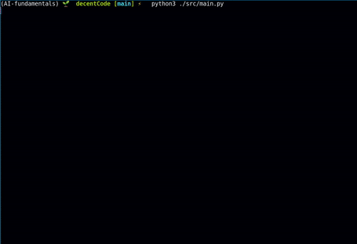

# AI formula solver

## Demo



## Manual

1. Run the program inside the right conda environnement:

    ```zsh
    python3 ./src/main.py
    ```

2. Line-up the formula inside the green box.
3. Press enter to take the image.
4. Press any key to cycle through the different characters.

## Dependencies

### Numpy

```zsh
conda install -c anaconda numpy 
```

### OpenCV

```zsh
conda install -c conda-forge opencv 
```

### Keras

```zsh
conda install -c conda-forge keras 
```

### Tensorflow

```zsh
conda install -c conda-forge tensorflow 
```
